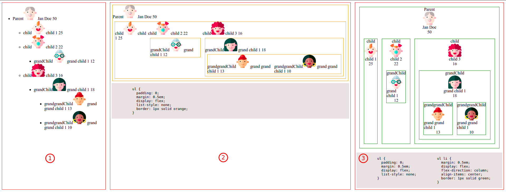
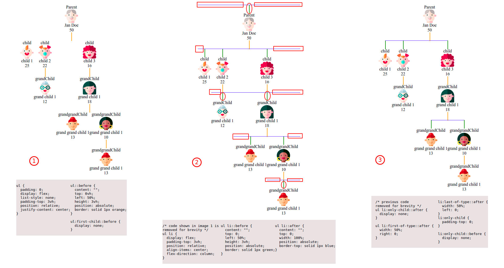
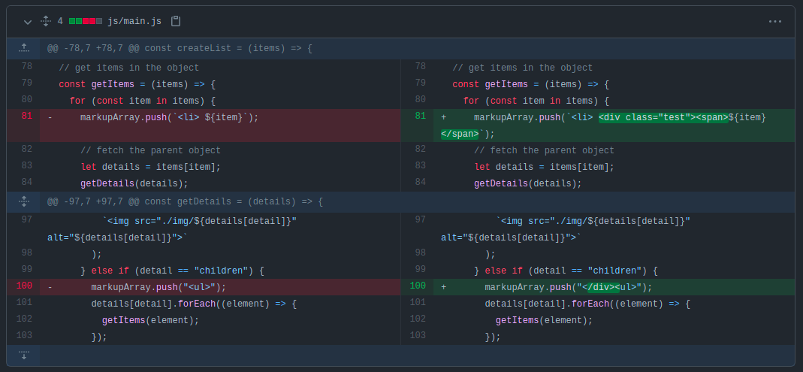

# Nested List - Tree View

Dynamically Building Nested List from JSON data and Vertical Tree view with pure CSS3

**Table of Contents**
<!-- MDTOC maxdepth:6 firsth1:0 numbering:0 flatten:0 bullets:0 updateOnSave:1 -->

&emsp;[Introduction](#introduction)   
&emsp;[1. Building Nested List from JSON data](#1-building-nested-list-from-json-data)   
&emsp;[1.1 Creating Family Tree](#11-creating-family-tree)   
&emsp;[2. Plotting Vertical Tree View](#2-plotting-vertical-tree-view)   
&emsp;&emsp;[2.1 Flip List to Vertical View](#21-flip-list-to-vertical-view)   
&emsp;&emsp;[2.2 Draw Connectors](#22-draw-connectors)   
&emsp;&emsp;[2.4 Formatting Elements](#24-formatting-elements)   
&emsp;[Resources](#resources)   
&emsp;[References](#references)   

<!-- /MDTOC -->
### Introduction

Building a tree view for the hierarchical data is a common task in the front-end development of web applications. In most cases, hierarchical data is available in JavaScript Object Notation (JSON) which is a lightweight data format, and we need to represent this data as a tree on the webpage. In this tutorial, we will walk through the steps to dynamically create a nested list from the JSON data and style it to a vertically oriented tree view. The tutorial will use jQuery expression evaluation statement, Flexbox layout, and Pseudo-classes and Pseudo-elements from CSS3.

The goal of the tutorial can be divided into two parts:

- In the first part, we will learn how to dynamically build a nested unordered list of items from JSON data.
- Then we will plot a vertically oriented tree view from the nested list with pure CSS3.

### 1. Building Nested List from JSON data

We will start with a simple data structure and then gradually move to the complex data structure. Let's consider the following simple data structure with a `Parent` and one `Child`:

```js
const data = {
  Parent: "Childa",
};
```

The `HTML` markup to create `UI` will look like the below snippet. For the sake of styling, we will use `span` elements nested inside each `li`.

```html
<ul>
  <li>
    Parent
    <ul>
      <li><span> Child </span></li>
    </ul>
  </li>
</ul>
```

Let's write some JavaScript code to create `HTML` the markup for the above data. We assume that there could be three data types in the data:

- Object
- String
- Array

In order to evaluate the above expressions, we will be using a [switch](https://developer.mozilla.org/en-US/docs/Web/JavaScript/Reference/Statements/switch) statement with [jQuery](https://jquery.com/). We will use `$.type` to evaluate three cases, a mockup of the function is:

```js
const createList = (items) => {
  switch ($.type(items)) {
    case "object":
      console.log(items);
      break;
    case "string":
      console.log(items);
      break;
    case "array":
      console.log(items);
      break;
  }
};
```

We create an `let markupArray = ['<ul>']` where we will push the HTML tags dynamically. The process will start by calling `createList` function. As we are dealing with the `JSON` data, we fall into the first case that is the `object` . So in this case, we will write another function `getItems` to iterate over the items of the object. As we know that there in our data object, there is only one item `Parent:'Child'` , so the function will return only one item `Parent`. The function will create a `li` parent item with nested `ul` for its children.

1. create `li` for the `Parent` with an opening `ul` tag for the children.
2. call the `createList` function for the value of `Parent` ( `Child` in this case).
3. as `Parent` is a string , we will fall under the string expression of `createList` the function that will just push the `li` tags for `Child` to `markupArray`.
4. at the end of the iteration, we will push the closing tags.

```js
const getItems = (items) => {
  for (const item in items) {
    // push li tags for parent
    // with nested opening ul tag for children
    markupArray.push(`<li> <a> ${item} </a> <ul>`);
    // evaluate expression for children
    createList(items[item]);
    // push closing tage
    markupArray.push("</ul></li>");
  }
};
```

Our modified `createList` function will become:

```js
// evaluate expressions
// evaluate expressions
const createList = (items) => {
  switch ($.type(items)) {
    case "object":
      getItems(items);
      break;
    case "string":
      markupArray.push(`<li> <span> ${items} </span> </li>`);
      break;
    case "array":
      console.log(items);
      break;
  }
};
```

Next, we will create a main function to call the `createList` function and add a closing `</ul>` tag to the `markupArray`. Inside the main function, we will make use of the regular [Array.join](https://developer.mozilla.org/en-US/docs/Web/JavaScript/Reference/Global_Objects/Array/join) function which will convert an array to a string. Let's create a div element `<div id="list"></div>` and set the contents to the concatenated string using the jQuery [html](https://api.jquery.com/html/) method.

```js
// call the function on page load
window.onload = () => {
  createList(data);
  markupArray.push("</ul>");
  $("#list").html(markupArray.join(""));
};
```

Summarily, we passed the data to the `createList` expression evaluation function that will call the `getItems` function as the data is of type `object`. The `getItems` function will iterate over the items of data and create a `li` for parent item and a nested `ul` list for the children. We will then pass each child to the evaluation function to check the type of children. At this point, the child is a string so we just add a `li` to the children `ul`.

Let's consider the case where the parent element has more than one child, an array of children. In that case, we will update the `array` case from `createList` function as follows:

```js
// evaluate expressions
const createList = (items) => {
    // code removed for brevity
    case "array":
      items.forEach((item) => {
        createList(item);
      });
      break;
  }
};
```

Let's consider the case where the parent element has more than one child, an array of children. In that case, we will update the array case from createList function as follows:

```js
// evaluate expressions
const createList = (items) => {
    // code removed for brevity
    case "array":
      items.forEach((item) => {
        createList(item);
      });
      break;
  }
};
```

In the case of an array, we will iterate over the items of the array to further check their types. So the items will under one of the cases we have already defined i.e object, string, or array, and the function will execute the respective action according to the type. Let's modify our data a bit and see this in action. If you have downloaded the project, then modify the data variable in main.js file and open the index.html file in the browser.

```js
const data = {
  Parent: ["Child 1", "Child 2", { Child3: "Sub Child" }],
};

// OR
const data = {
  Parent: {
    Child1: "Child 1",
    Child2: { Child21: "Child 21", Child22: "Child 22" },
    Child3: [
      "Child 31",
      "Child 32",
      { Child33: "Sub Child" },
      { Child4: ["Child 41", "Child 42", { Child43: "Sub Child" }] },
    ],
  },
};
```

### 1.1 Creating Family Tree

At this point, we have successfully created the tree view from the nested JSON data. However, according to the original idea of the project, we want to plot a family tree structure where each member of the family has some bunch of details and a picture as well.

```js
// add a parent with some details
const data = {
  Parent: {
    img: "father.png",
    name: "Jan Doe",
    age: "50",
  },
};
```

To adopt the structure as shown in the picture above, let's clean up stuff and start from the beginning. Again, starting with the expression evaluation function `createList`, as our data is `object`, we will pass it to the `getItems` function.

```js
// evaluate expressions
const createList = (items) => {
  switch ($.type(items)) {
    case "object":
      getItems(items);
      break;
  }
};
```

If we look at our new data structure, we see that we have two objects: one `data` object and inside that there is a `Parent` object. The process will go through in following steps:

1. For the first, `data` object, we want to push it as a `li` item of root `ul`.

```js
// get items in the object
const getItems = (items) => {
  for (const item in items) {
    markupArray.push(`<li> ${item}`);
    markupArray.push("</li>");
  }
};
```

2. For the `Parent` object, we will iterate over the details of `Parent` object. Let's create another `getDetails` function. Inside this function, we will loop over the object items, fetch the item value and push a `span` tag for each item.

```js
// get details
const getDetails = (details) => {
  // iterate over the detail items of object
  for (const detail in details) {
    // fetch the value of each item
    markupArray.push(`<span> ${details[detail]} </span>`);
  }
};
```

We will fetch details of the `Parent` object and call the `getDetails` function inside the iteration of `getItems` function. Its important to note that here (`details[detail]`) we are trying to get the values of the items. In this way, first we find the object in our data and iterate over the object to get its details. The modified `getItems` function:

```js
// get items in the object
const getItems = (items) => {
  for (const item in items) {
    markupArray.push(`<li> ${item}`);
    // fetch the parent object
    let details = items[item];
    getDetails(details);
    // push the closing tag for parent
    markupArray.push("</li>");
  }
};
```

Before moving on, let's tweak one change for the image. Right now, we just the image name but we want to place an iamge there. For this, we will place a `if - else` statement to check if the `detail` is an `img` and put the `img` tag instead of `span` element. Also, in the `data` object, we can move `imge` item to the top of other items, and set style for `span` and `img` element as `display:block`.

```js
// get details
const getDetails = (details) => {
  // iterate over the detail items of object
  for (const detail in details) {
    // fetch the value of each item

    if (detail == "img") {
      markupArray.push(
        ``
      );
    } else {
      markupArray.push(`<span> ${details[detail]} </span>`);
    }
  }
};
```

Next, we have to deal with the children and for this let's add an array of children to the `Parent` element. It's important that the child should adopt the same structure as the parent i.e. some details and an array of children.

```js
const data = {
  Parent: {
    img: "father.png",
    name: "Jan Doe",
    age: "50",
    children: [
      {
        child: {
          img: "child_1.png",
          name: "child 1",
          age: "25",
        },
      },
    ],
  },
};
```

Now we have three cases to evaluate: if the key of the item inside the object is `img`, `children` or something else. We already have approaches to deal with the `img` and other stuff, so now we will proceed with the `children` array. In essential, we need to create an `ul` that will contain all the items in the array as `li`. In this particular case:

1. first, we will push a `<ul>` tag as this will be a nested list inside the parent `li`.
2. Then, loop through the items of the array and pass each item to the `getItems` function. This function will push a `<li>` tag and then call `getDetails` function (as items inside the array are objects) for each item. Thus, repeating the same process we did for the parent element.
3. At the end of the loop, we push the closing tag `</ul>` to the `markupArray`.

```js
// get details
const getDetails = (details) => {
  // iterate over the detail items of object
  for (const detail in details) {
    // fetch the value of each item
    if (detail == "img") {
      markupArray.push(
        ``
      );
    } else if (detail == "children") {
      markupArray.push("<ul>");
      details[detail].forEach((element) => {
        getItems(element);
      });

      markupArray.push("</ul>");
    } else {
      markupArray.push(`<span> ${details[detail]} </span>`);
    }
  }
};
```

### 2. Plotting Vertical Tree View

The process of plotting vertical tree view can be broadly divided into the following steps:
Flip the horizontal view to vertical view
Draw connectors between the elements

#### 2.1 Flip List to Vertical View

This is a fairly easy part and can be easily achieved using CSS [Flexbox](https://css-tricks.com/snippets/css/a-guide-to-flexbox/) layout. In this case, we will set:

- `ul` elements to the vertical direction
- `li` elements to the horizontal direction

The images are quite big, so the image width and height are set to 50px.

From the data structure, we know that `ul` is the parent element and `li` is the child element. To use the flexbox layout, we need to make the parent element a flex container. The elements inside the flex container will become the flex items. By default, the `li` are block elements and are vertically stacked. Flexbox layout will align the flex items in a row in case direction is not specified. It is important to note that flexbox only applies to the items of the flex container, not to the nested items of flex items. However, for the current case, the nested items are again `ul` so flexbox layout will be applied to them as well. As a result, we will have rows for all the `ul` and nested `ul` as well. Additionally, we will remove the default indentation and list-style as well.

As a result, we will see a vertical view of `ul` with the `li` in the horizontal direction (image 2 in the following screenshot). To change the direction of `li`, we will apply the flexbox model to it and set the flexbox direction as `column` (image 3). With these two simple styles, we have flipped the view to the horizontal tree view.



#### 2.2 Draw Connectors

In this section, we will draw connectors:

- between the parent and siblings
- between the siblings and [sub]siblings

To achieve this, we will make use of [Pseudo-classes and pseudo-elements](https://developer.mozilla.org/en-US/docs/Learn/CSS/Building_blocks/Selectors/Pseudo-classes_and_pseudo-elements). To place the connectors horizontally in the middle and vertically on the top of the element, we will use `left:50%` and `top:0` position specifiers respectively.

- Let's start with adding vertical connectors before each parent element(`ul`), except the very first parent element. This will be done using the `::before` pseudo-class relative to the `ul`, along with adding a `padding-top` to the `ul` equal to the height of the pseudo-element. To hide the connector before the very first element of `ul`, we will use pseudo-class `:first-child` to set the display of pseudo-element `::before` to `none`. The result of this can be seen in image 1 of the below screenshot.

- Adding connectors between the siblings will be done in two steps. First, we will add vertical connectors before each `li` element using `::before` pseudo-element relative to the parent `li`. In the next step, we will place horizontal connectors for the siblings using the `::after` pseudo-element with `width` and `border-top` properties. The resultant image is shown as image 2 in the screenshot below.



- It can be seen from the above screenshot that we need to fix some issues:
  - First, remove the horizontal connector from the very first element. This issue can be fixed with the use of `only-child` pseudo-class to hide the display of pseudo-elements in case there is only one child.
  - Next, remove the left and right connectors for the first and last element of a group respectively. This will be fixed using `first-of-type` and `last-of-type` pseudo-classes with a width of `50%` and position right and left 0 respectively.
  - Finally, remove the `::before` connects for the single element in the group using `padding-top:0` and `display:none`.

#### 2.4 Formatting Elements

To add some styles, we will wrap details `span` elements into a single `div` element. The following git diff screenshot shows what has been changed.



We will add some padding between the children, background color and text transformation.

### Resources

Images used in this tutorial are downloaded from [Flaticon.com]()

### References

- [CSS Flexbox Model](https://www.freecodecamp.org/news/understanding-flexbox-everything-you-need-to-know-b4013d4dc9af/)

- [Pseudo-classes and Pseudo-elements](https://developer.mozilla.org/en-US/docs/Learn/CSS/Building_blocks/Selectors/Pseudo-classes_and_pseudo-elements)

- [Fractaledmind - CSS Tree Vertical](http://fractaledmind.com/articles/css-tree-vertical/)

- [Thecodeplayer - CSS3 Family Tree](https://thecodeplayer.com/index.php/walkthrough/css3-family-tree)

- [Dabeng - OrgChart](https://github.com/dabeng/OrgChart)
